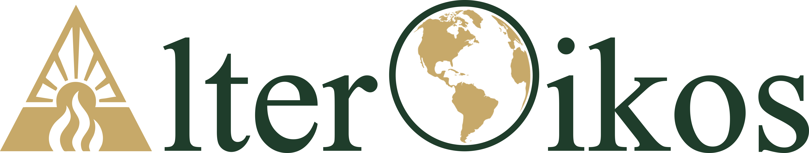
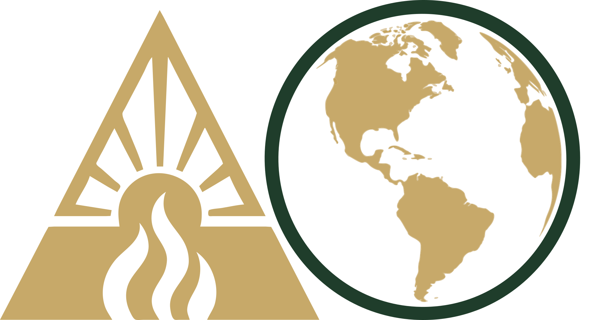

::::: {#ppc}

# Δlter🌎ikos

### Integrative Science for a Changing World

## About the Initiative

The **AlterOikos Initiative** is an innovative and interdisciplinary research program dedicated to deciphering the complexity of life in systems under transformation. Our purpose is to integrate multiple dimensions of biological and social knowledge to understand the gears of planetary resilience in the Anthropocene.

The name—which joins the Latin *Alter* (change) to the Greek *Oikos* (ecology/home)—synthesizes our philosophy: change is not just an object of study, but the lens through which we interpret nature.

### 🔎 **Frontiers of Knowledge**

Our work is inherently transverse, moving between fundamental ecological theory and evidence-based conservation practice. The initiative is organized around three fundamental scientific axes:

### 1. Eco-Evolutionary Dynamics and Disturbance Ecology

We investigate the bidirectional feedbacks between ecological and evolutionary processes. Our focus lies on how rapid and intense disturbances—such as fire regimes and thermal stress—shape natural selection, phenotypic plasticity, and the persistence of populations and communities.

### 2. Biogeography, Pyrogeography, and Climate Change

We explore the distribution of life and fire across space and time. By crossing climate change data with the geographic history of landscapes, we seek to anticipate how global transformations rearrange biotic frontiers and the natural cycles of tropical and transition ecosystems.

### 3. Management, Conservation, and Human Dimensions

We understand that biodiversity conservation is inseparable from human reality. This axis is dedicated to natural resource management and **social conservation**, integrating human dimensions and public engagement to ensure that science translates into just and effective socio-environmental solutions.

# 🏛️ **Strategic Structure**

## 🚀 **Mission**

"To investigate the dynamics of change in biological systems, integrating ecology and evolution to understand how biodiversity responds, adapts, and shapes environments under disturbance."

## 💡 **Vision**

"To become an international reference in the science of change (Alter-Ecology), leading cutting-edge research that connects eco-evolutionary theory to the practical conservation of tropical ecosystems."

## 🎯 **Objectives**

-   **Decipher Feedbacks:** Quantify eco→evo and evo→eco interactions in populations and communities subjected to environmental gradients and fire regimes.

-   **Methodological Innovation:** Develop and apply robust analytical tools (in R, Python, and Remote Sensing) for long-term data.

-   **Leadership Training:** To train critical and technically exceptional researchers, promoting a diverse and collaborative science.

-   **Applied Science:** Translate evolutionary findings into strategic guidelines for biodiversity management and conservation in the Anthropocene.

## ✨ **Values (The AlterOikians DNA)**

| Valores | **O que significa na prática?** |
|------------------------------------|------------------------------------|
| Rigor Científico | Aderência estrita ao método, transparência e busca pela verdade baseada em evidências. |
| Adaptabilidade | Assim como os sistemas que estudamos, o grupo evolui e se ajusta a novos desafios e tecnologias. |
| **Ciência Aberta** | Compromisso com a reprodutibilidade, compartilhamento de dados (Open Data) e códigos. |
| **Inquietude Intelectual** | O desejo constante de "alterar" o status quo do conhecimento e fazer as perguntas difíceis. |
| **Simetria de Saberes** | Valorização do conhecimento tradicional e local (indígenas, quilombolas, geraizeiros) como parceiro fundamental na ecologia do fogo e conservação. |
| **Ciência Cidadã e Engajamento** | Compromisso em romper os muros da universidade, traduzindo dados em diálogos e envolvendo o público na construção do conhecimento. |
| **Colaboração Radical** | Parcerias horizontais e transdisciplinares que buscam soluções integradas para problemas complexos. |

# 

# Curiosidades

## **Etymology (origin of the name)**

The choice of the name **AlterOikos** is linguistically rich and carries significant academic weight, as it joins two of the founding languages of scientific thought: **Latin** and **Greek**.

-   **The Prefix: Alter (Latin)**

    -   *Origin:* From the Latin *alter*, meaning "other", "the other of two", or "to change".

    -   *Scientific Significance:* In biology and ecology, it refers to the concepts of **alteration** and **modification**.

    -   *Application:* Represents the central focus of our research: **disturbance**. Fire and anthropogenic environmental changes are the agents that *alter* the original state of systems, forcing phenotypic and demographic responses.

-   **The Suffix: Oikos (Greek)**

    -   *Origin:* From the Ancient Greek *οἶκος* (oîkos), meaning "house", "residence", "heritage", or "family".

    -   *Scientific Significance:* This is the fundamental morphological root of the word **Ecology** (*Oikos* + *Logos* = the study of the house).

    -   *Application:* Defines our study setting. It is not just about isolated organisms, but the "home" of these organisms—the environment, the interactions, and the ecosystem structure.

> **The Synthesis: "The Ecology of Change"** When we merge the two terms, **AlterOikos** can be literally translated as "The Altered House" or, in a more academic interpretation, **"The Ecology of Change"**.

## **Visual Identity Concept**

The visual identity of AlterOikos synthesizes, in a minimalist way, the central processes that structure our research: environmental change, ecological dynamics, and macrogeographic scale.

### Δ (Delta) — change and ecological dynamics

The symbol **Δ**, integrated into the letter “A”, represents transformation. In scientific language, the delta is widely used to indicate variation—a fundamental concept for understanding ecological and evolutionary responses to environmental disturbances. Inside the Δ, two elements structure this idea:

-   **Solar rays:** indicating energy and renewal, referring to the natural cycles that sustain ecosystems.

-   **Flames:** representing fire as an ecological process—not just as a disturbance, but as a structuring agent of biodiversity.

### O (Globe) — *oikos* and macrogeographic scale

The “O” of Oikos is represented as a globe, symbolizing the concept of “home” in ecology—the integrated system where organisms and the environment interact. The emphasis on the Americas reflects:

-   The geographic context of the research.

-   The connection with Neotropical systems. The outer ring suggests integrity and interconnectivity between ecological systems.

### Integration Δ–O

The juxtaposition of the two symbols (Δ–O) expresses the conceptual core of the group: **how environmental changes shape ecological systems across multiple scales.**
:::::