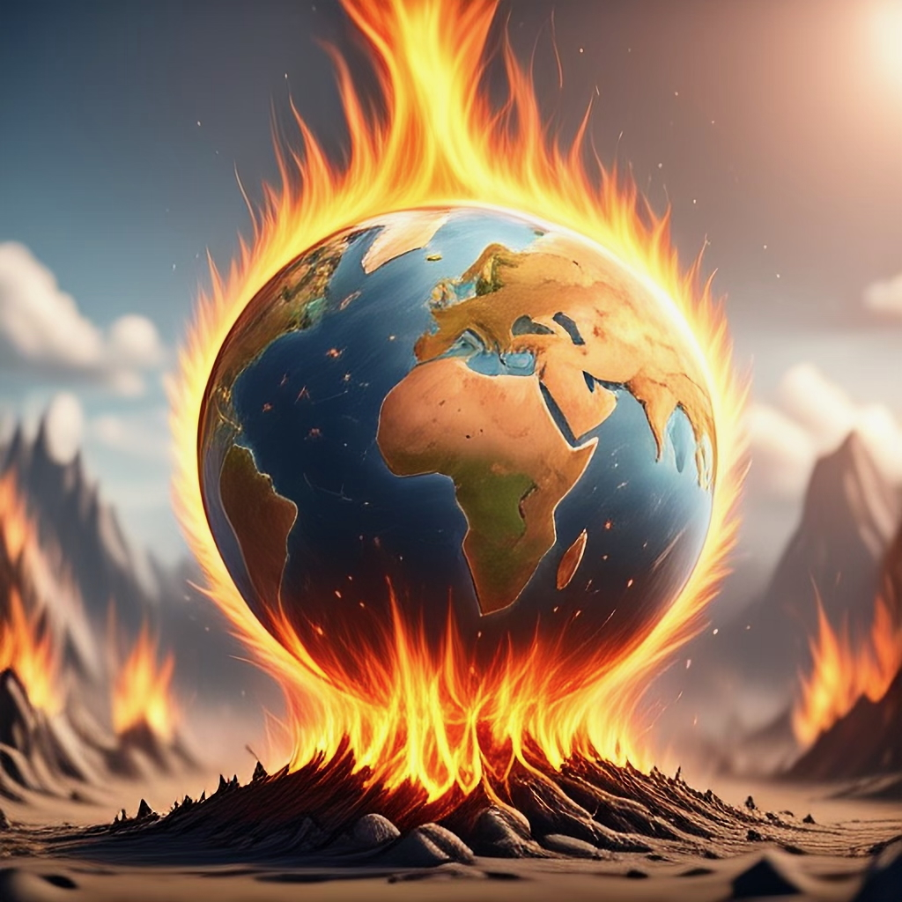

A ciência das mudanças climáticas é o estudo interdisciplinar dos sistemas climáticos da Terra em constante transformação, seus vetores, impactos e soluções. Ela integra a física atmosférica, a ecologia, a geografia e as ciências sociais para compreender como as atividades humanas (ex: emissões de gases de efeito estufa, mudanças no uso da terra) alteram o clima global e regional — e como essas mudanças reverberam em cascata através dos ecossistemas e das sociedades.

{fig-align="center" width="400"}

### **Principais tópicos de investigação**

-   **Vetores e Retroalimentações (Feedbacks):** Quantificação de influências antropogênicas (ex: desmatamento, combustíveis fósseis) e ciclos de retroalimentação natural (ex: interações entre incêndios florestais e o clima).

<!-- -->

-   **Impactos Ecológicos:** Avaliação das respostas das espécies ao aquecimento, às mudanças nos padrões de precipitação e a eventos extremos — da fisiologia térmica de répteis a climas em processo de alteração.

-   **Adaptação e Mitigação:** Identificação de estratégias equitativas para reduzir riscos, aumentar a resiliência e proteger a biodiversidade.

Utilizo Modelos de Distribuição de Espécies (**SDMs**) e modelos demográficos integrados a dados ecofisiológicos e de microclima para compreender as respostas biológicas ao clima. Ao aplicar cenários de projeção de mudanças climáticas, busco prever mudanças futuras na área de distribuição, na fenologia e na dinâmica populacional das espécies.

### **Por que isso é importante**

A ciência das mudanças climáticas transcende silos disciplinares, oferecendo percepções aplicáveis para enfrentar um dos maiores desafios do nosso tempo. Desde a fundamentação de políticas públicas até a orientação da conservação prática em campo, ela nos capacita a proteger tanto os ecossistemas quanto as comunidades que deles dependem.

\
[Cheque minhas publicações relacionadas às mudanças climáticas aqui.](publications.qmd)