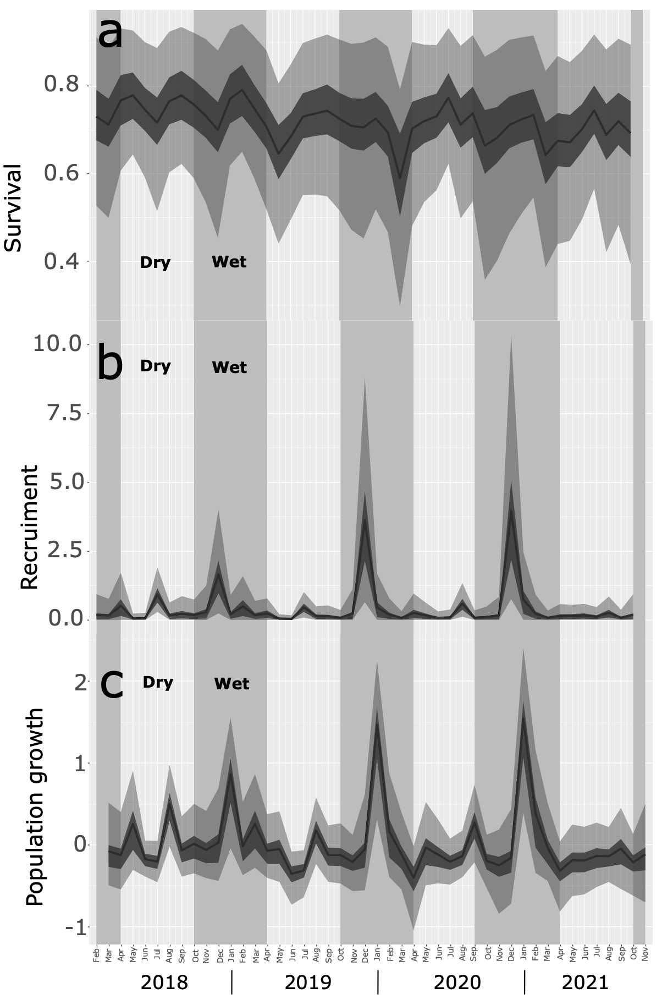

A biodemografia, também conhecida como ecologia de populações, investiga os vetores biológicos e ambientais da dinâmica populacional — sobrevivência, reprodução e dispersão — entre as espécies. Ela funde princípios da demografia, biologia evolutiva e ecologia para compreender como a estrutura populacional, as estratégias de história de vida e as pressões ambientais moldam as populações no tempo e no espaço.

{fig-align="center" width="500"}

### Questões fundamentais que investigo

-   Como a longevidade, a fecundidade e as taxas de sobrevivência variam entre as espécies, e quais *trade-offs*(compensações) evolutivos impulsionam essas diferenças?

-   Quais fatores (ex: extremos climáticos, perda de habitat ou regimes de fogo) ameaçam a viabilidade populacional?

-   Como os modelos demográficos podem fundamentar estratégias de conservação para espécies em risco?

Utilizando modelagem estatística, estudos de campo longitudinais e métodos de marcação-recaptura, meu trabalho em biodemografia aborda desafios como a resiliência de espécies em diferentes regimes de fogo e as mudanças nos traços de história de vida impulsionadas pelo clima.

### Por que isso é importante

A biodemografia revela os "motores ocultos" da perda de biodiversidade e da adaptação. Ao quantificar os riscos de sobrevivência e o sucesso reprodutivo, ela fornece percepções aplicáveis para proteger espécies em uma era de rápidas mudanças ambientais.

\
[Cheque minhas publicações relacionadas à biodemografia aqui.](publications.qmd)