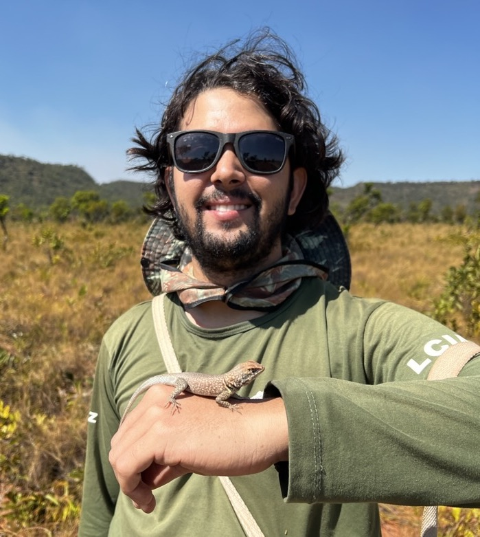

#### Cientista Ambiental com ampla experiência em ensino, pesquisa e consultoria

\
\
Eu sou o Heitor C. Sousa. Estou atualmente trabalhando como Pesquisador Pós-Doc na [Coleção Herpetológica](https://chunb.org) da [Universidade de Brasília](https://www.unb.br). Eu tenho experiência em inventários da biodiversidade e estudos ecológicos e ecofisiológicos de anfíbios e répteis. Eu tenho interesse amplo em ecologia e evolução de animais, especialmente de ecossistemas Neotropicais, como da Caatinga, do Cerrado Brasileiro e da Floresta Amazônica. Minha pesquisa foca particularmente em pirogeografia (incluindo a ecologia do fogo), biodemografia (ecologia populacional) e mudanças climáticas globais. Eu sou um ecólogo com orientação altamente quantitativa, e uso modelos estatísticos para investigar problemas aplicados relacionados à sustentabilidade e conservação da biodiversidade.

\



```{r, echo=FALSE}
#| classes: '.g-col-lg-6 .g-col-12 .g-col-md-12'
#| warning: false
source("carousel.R")
carousel("gallery-carousel", 6000, 
         yaml.load_file("carousel.yml"))
```