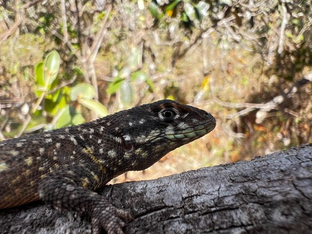
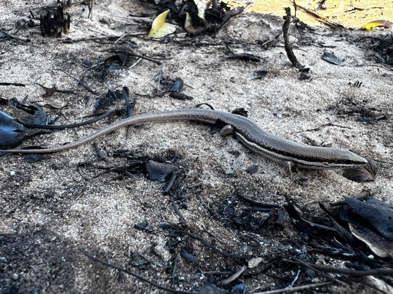
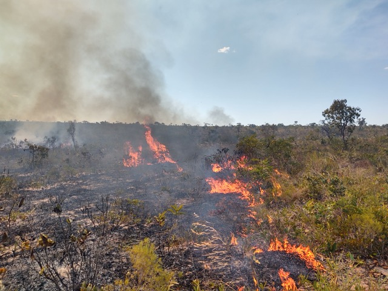
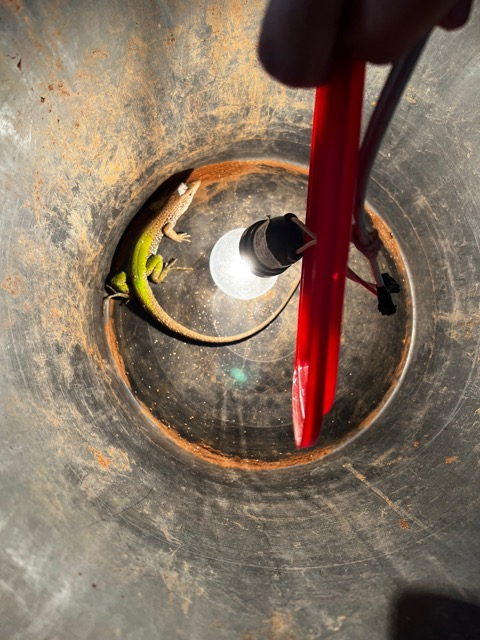
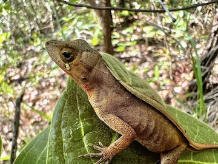
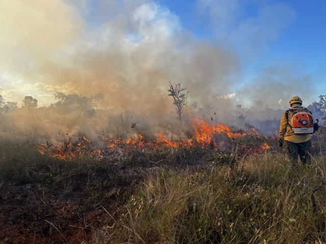

#### Interesses de Pesquisa

Meu trabalho engloba **ecologia** (**animal**), **evolução**, **pirogeografia** e **conservação** **social,** com um foco no entendimento de como os sistemas biológicos, processos ambientais e sociedades humanas interagem. Abaixo estão os meus temas de pesquisa principais (clique para explorar):

\

[{fig-align="left"}](demography.qmd)

\

[{fig-align="left"}](community.qmd)

\

[{fig-align="left"}](fire.qmd)

\

[{fig-align="left"}](climchange.qmd)

\

[{fig-align="left"}](zoology.qmd)

\

[{fig-align="left"}](social.qmd)

\