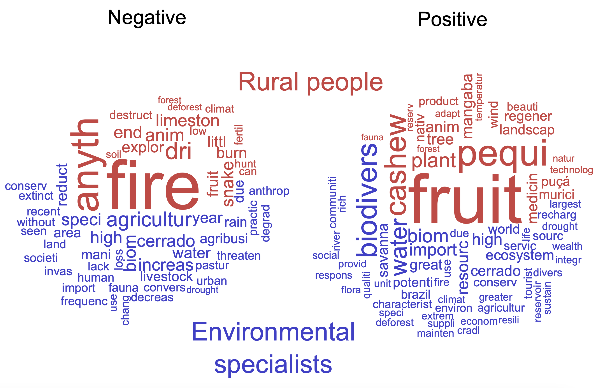

A **conservação social** é uma abordagem interdisciplinar de proteção ambiental e manejo de recursos que prioriza a integração de comunidades humanas, valores culturais e equidade social nas estratégias de conservação. Ela enfatiza a interdependência entre a saúde ecológica e o bem-estar da sociedade, reconhecendo que uma conservação eficaz exige o atendimento das necessidades, direitos e participação humana.

{fig-align="center" width="400"}

### Focos principais do meu trabalho

-   **Práticas Culturais e Biodiversidade:** Como práticas tradicionais (ex: manejo do fogo) sustentam a biodiversidade e mitigam ameaças ecológicas.

-   **Percepção Ambiental:** Abordagem da percepção em relação ao fogo, às mudanças climáticas e à biodiversidade.

-   **Resiliência e Bem-estar:** Priorização de metas de conservação e gestão ambiental que conectem a resiliência ecológica ao bem-estar humano.

Ao combinar etnografia, mapeamento participativo e trabalho de campo ecológico, minha pesquisa em conservação social une disciplinas como a **ecologia política**, a **antropologia ambiental** e a **diversidade biocultural**. Esse trabalho fundamenta diretamente estratégias para uma governança equitativa do fogo, proteção de espécies e resiliência climática — alinhando-se à minha atuação em pirogeografia e zoologia (ex: conservação de répteis e anfíbios culturalmente significativos).

### Por que isso é importante

A conservação social redefine o conceito de "sucesso" na gestão ambiental: ecossistemas prósperos não podem existir sem comunidades prósperas. Ao integrar justiça, conhecimento tradicional e ciência, essa abordagem oferece caminhos para restaurar tanto as paisagens quanto as divisões sociais em uma era de mudanças globais.

[Cheque minhas publicações relacionadas à conservacão social aqui.](publications.qmd)